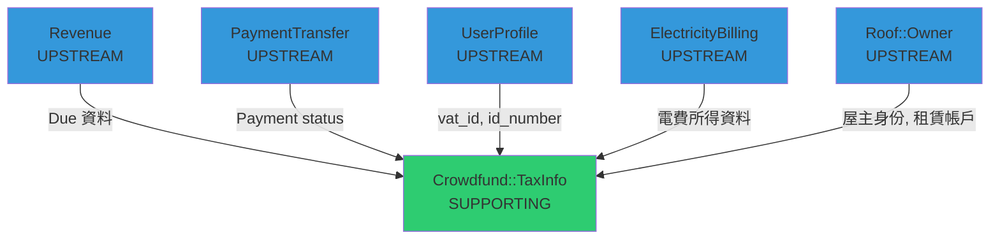
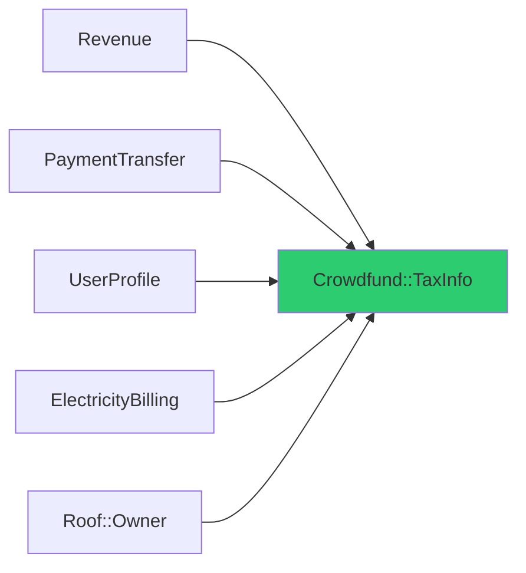

# core_web Domain Map (領域邊界和關係圖)

> **Purpose**: Visualize domain boundaries, relationships, and context mapping for core_web. This map helps understand how different parts of the system interact.

**Last Updated**: 2026-04-07
**Maintained By**: Development Team + atdd-knowledge-curator

---

## How to Use This Document

- **For Developers**: Understand domain boundaries and integration points
- **For AI Agents**: Load before cross-domain tasks to understand relationships
- **For Architects**: Reference for architectural decisions
- **For Updates**: Use atdd-knowledge-curator to propose changes

---

## Domain Overview

### All Domains

| Domain | Type | Description | Status |
|--------|------|-------------|--------|
| Crowdfund::TaxInfo | Supporting | 管理群眾集資平台的所得稅申報資料 | Active |

---

## Domain Boundaries

### Domain: Crowdfund::TaxInfo

**Type**: Supporting

**Business Capability**: 所得稅申報資料管理 -- 彙整付款所得、轉換稅務格式、匯出申報檔案

**Bounded Context**: 群眾集資平台的所得稅申報作業，從上游取得付款和用戶資料，產出符合政府格式的申報資料

**Responsibilities**:
- 彙整各來源的所得資料（一般付款、屋頂租賃）
- 判定所得類別（IncomeMethod）
- 解析所得人身分識別碼（IdentityNumber）
- 轉換所得月份為民國年格式（IncomeMonth）
- 匯出 XLSX 申報檔案（含過濾條件）
- 批次上傳所得資料
- 所得清單查詢管理

**Key Entities**:
- TaxInfo (Aggregate Root)
- TaxInfoDetail
- Due
- Payment

**Includes** (範疇內):
- 所得申報資料 CRUD
- 匯出過濾邏輯（payment status、RoofRental bypass）
- 所得類別判定、身分碼解析、月份轉換

**Excludes** (範疇外):
- 付款流程（PaymentTransfer）
- 營收計算（Revenue）
- 用戶身份管理（UserProfile）
- 屋主資格認定（Roof::Owner）
- 電費帳單（ElectricityBilling）

---

## Domain Relationships

### Context Mapping

### Relationship Patterns

#### Pattern: Customer-Supplier (Revenue -> TaxInfo)
**Upstream**: Revenue
**Downstream**: Crowdfund::TaxInfo

**Description**: TaxInfo 從 Revenue 取得 Due（應付款項）資料作為所得計算的基礎。

**Contract**:
- Upstream exposes: Due 資料（金額、對象、狀態）
- Downstream consumes: Due 記錄用於所得彙整

---

#### Pattern: Customer-Supplier (PaymentTransfer -> TaxInfo)
**Upstream**: PaymentTransfer
**Downstream**: Crowdfund::TaxInfo

**Description**: TaxInfo 依賴 Payment 的 status 欄位來過濾匯出資料（CR-001）。

**Contract**:
- Upstream exposes: Payment status（success/failed 等）
- Downstream consumes: 以 status = success 作為匯出過濾條件

---

#### Pattern: Customer-Supplier (UserProfile -> TaxInfo)
**Upstream**: UserProfile
**Downstream**: Crowdfund::TaxInfo

**Description**: TaxInfo 從 UserProfile 取得所得人的身分識別資訊（vat_id, id_number），用於 CA-002 IdentityNumber Resolution。

**Contract**:
- Upstream exposes: 用戶的 vat_id、id_number
- Downstream consumes: COALESCE(vat_id, id_number) 作為申報身分碼

---

#### Pattern: Customer-Supplier (Roof::Owner -> TaxInfo)
**Upstream**: Roof::Owner
**Downstream**: Crowdfund::TaxInfo

**Description**: TaxInfo 從 Roof::Owner 取得屋主身份和 RoofRentalAccount 資訊，用於 CA-001 IncomeMethod 判定和 CR-002 bypass 邏輯。

**Contract**:
- Upstream exposes: 屋主身份、RoofRentalAccount 租賃資料
- Downstream consumes: 屋主判定 -> lease_income；租賃帳戶 -> bypass payment filter

---

## Dependency Graph

**Dependency Analysis**:
- **Highly Depended Upon**: Revenue, UserProfile（提供核心資料）
- **Highly Dependent**: Crowdfund::TaxInfo（依賴 5 個上游 Domain）
- **Independent**: 無（TaxInfo 目前無已知下游消費者）

---

## Maintenance Log

| Date | Change | Changed By |
|------|--------|------------|
| 2026-04-07 | Initial domain map created for Crowdfund::TaxInfo with 5 upstream dependencies | curator |
